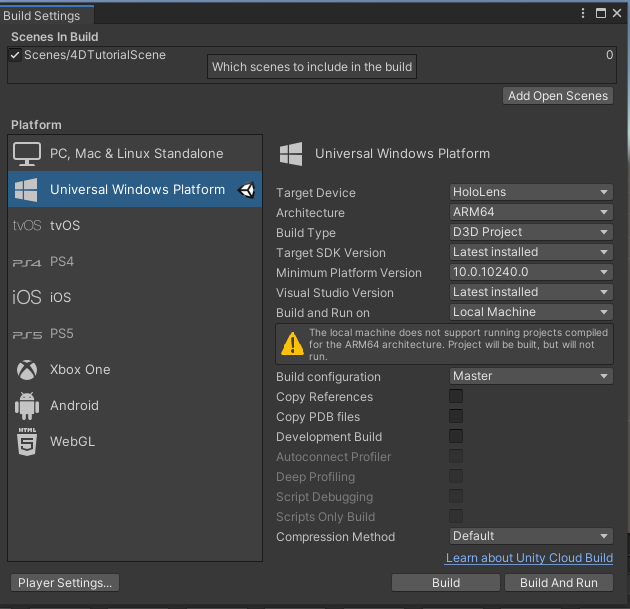

# 4d-holographic-tutorials

## System Requirements
To the best of our knowledge, our project can only be built in a Windows environment. Our project was tested and runs in Unity without issues on a Windows 10 Education edition version 21H1. Our reference machine is using an "11th Gen Intel(R) Core (TM) i5-11400F @ 2.60 GHz" processor with 32 GB of RAM, and an "NVIDIA GeForce RTX 3060" graphics card, which allowed us to build and deploy our application in a reasonable amount of time. Lower specifications will most likely work without issues, but might incur longer build times or other issues. For a faster setup, make sure to use an ethernet connection as the program size of many components is rather large and will take quite some time to download (estimated accumulated size ~ 10GB).

## Build Instructions / Environment Setup
1. Install Unity Hub ([Link](https://unity3d.com/get-unity/download)). You will probably have to create a Unity account to get this up and running.

2. Open the application and install the Unity editor for version 2019.4.39f1 (Modules mentioned below can directly be added here).

3. Go to "Installs" and in the settings of the just installed editor, choose "Add modules". Add the modules "Universal Windows Platform Build Support" and "Windows Build Support (IL2CPP)".

4. Install .NET 6.0 (needed for the Mixed Reality Toolkit for Unity provided by Microsoft [Link](https://dotnet.microsoft.com/en-us/download/dotnet/6.0))

5. Install the Visual Studio 2022 Community Edition ([Link](https://visualstudio.microsoft.com/downloads/))

6. Clone the project from our Github repository using either Github Desktop or the Git CLI ([Link](https://github.com/lukas-walker/4d-holographic-tutorials.git))

7. Add the project in your Unity Hub and open it with the corresponding editor.

8. In Unity, adjust the following configurations:
  
  * Edit -> Project Settings -> Player -> Publishing Settings -> Supported Device Families -> Holographic
  * Edit -> Preferences -> External Tools -> External Script Editor -> Visual Studio Community 2022

9. Enable Developer Mode in Developer Settings in your Windows settings

10. Start up your HoloLens, connect it to your local network (the same your machine is also connected to through WIFI), and access the IP of your HoloLens by saying "What is my IP?". A pop-up with the address will appear. Write this address down.

11. To build the project in Unity and create a Microsoft Visual Studio Solution, proceed as follows:

  * File -> Build Settings
  * Switch to Universal Windows Platform
  * Add Scenes/4DTutorialScene to the Scenes In Build
  * Adjust the build configurations as shown in this picture
  
  * Then, hit build, choose your folder of choice for the build (create a new folder called build), and after some time (117 s in our case) a MVS solution should be available.

12. To deploy the application to your HoloLens 2, proceed as follows:

  * Open the solution in Visual Studio 2022 and install any recommended (probably v143 build tools) plugins
  * Make sure 4d-holographic-tutorials is in scope
  * Go to Projects -> Properties -> Debugging
  * Choose Remote Machine in Debugger to launch
  * Enter the IP address of your HoloLens previously written down into the Machine Name field
  * Make sure ARM64 is selected as your target architecture
  * Make sure Master is selected as your target build type
  * Make sure your HoloLens is turned on and connected to your local network
  * Make sure your machine is connected to the same network
  * Start the build and the deployment of the solution: Build -> Deploy Solution
  * After some time (77 s in our case) the application will be available in the section All Apps on the HoloLens

## Resources

MRTK Documentation https://docs.microsoft.com/en-us/windows/mixed-reality/mrtk-unity/

MRTK GitHub https://github.com/microsoft/MixedRealityToolkit-Unity/releases

Mixed Reality Feature Tool https://docs.microsoft.com/en-gb/windows/mixed-reality/develop/unity/welcome-to-mr-feature-tool

MRTK Input Simulation Guide https://docs.microsoft.com/en-us/windows/mixed-reality/mrtk-unity/features/input-simulation/input-simulation-service?view=mrtkunity-2021-05
