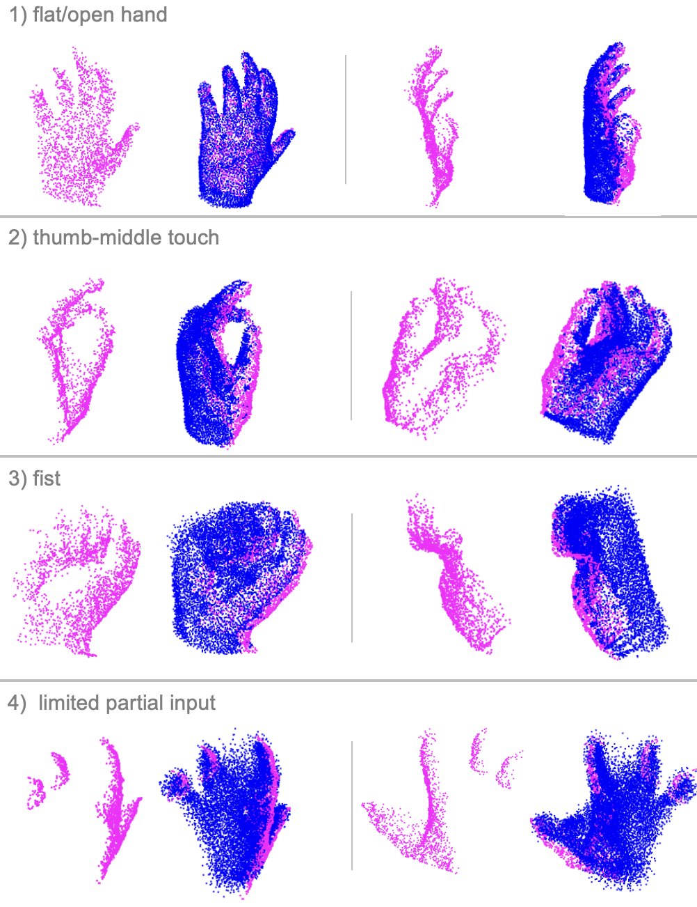
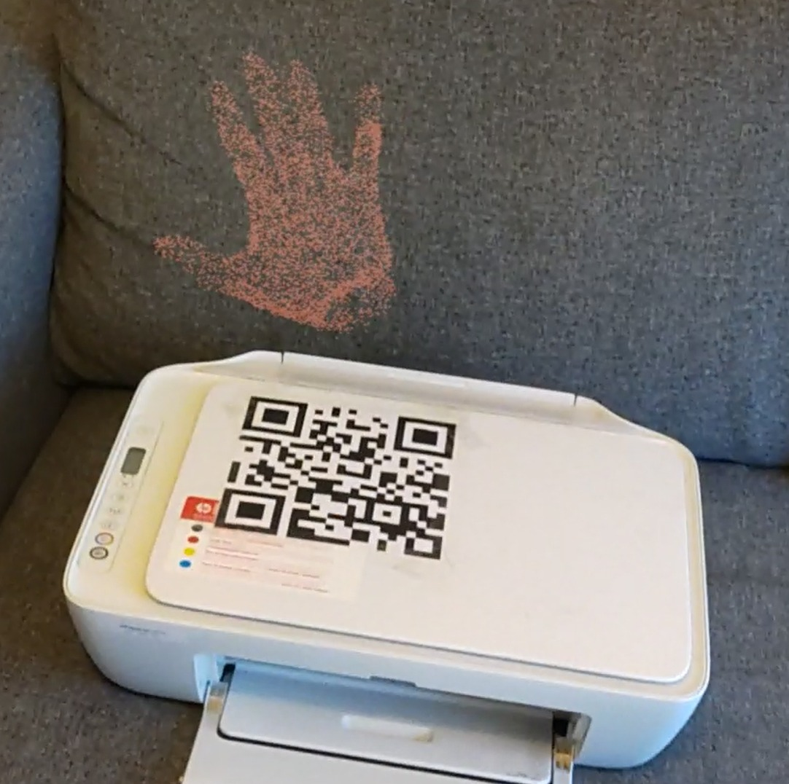

```markdown
# Point Cloud Completion For Mixed Reality - ETH Zurich, January 2024

## Project Overview

Welcome to the Point Cloud Completion for Mixed Reality project at ETH Zurich, completed in January 2024. This repository showcases the collaborative work of Arvid Berg, Lukas Schüepp, and Simon Schläpfer. 

This project was supervised by the Mixed Reality and AI Lab of Microsoft Zurich.

## Abstract

Mixed Reality applications, such as Dynamics 365 Guides, can help improve productivity with holographic instructions. These instructions are generated using point cloud data captured from an instructor’s perspective while performing a specific task. However, this initial representation is partial and lacks completeness from alternative viewpoints. In this project, we propose leveraging learning-based algorithms to deliver more complete representations. To achieve this, we train an encoder-decoder transformer-based model to predict completed point clouds constructed from multi-view given its corresponding point cloud from a single-view. We show that our approach can perform with an accuracy of 97% when evaluated on the Percentage of Correct Keypoints metric within a threshold radius of 0.1 normalized distance. Additionally, we present a complete pipeline that anchors the location, records, segments, predicts, and integrates completed point clouds into the Mixed Reality environment, allowing for the replay of the recorded scene with the completed point cloud.




## Demo

Watch our demo [here](https://youtu.be/nIc4qZVUCyw).

## Report

Access the project report in PDF format: [Report/Point_Cloud_Completion_For_Mixed_Reality.pdf](Report/Point_Cloud_Completion_For_Mixed_Reality.pdf).

## Project Structure

The repository is organized into five main folders, each serving a specific purpose:

### 1. Dataset

This folder contains code responsible for modifying the MVHand and FreiHand datasets. These modifications may include preprocessing steps or adjustments tailored to the project's requirements.

### 2. PoinTr

In this folder, you'll find code related to training and inference for the AdaPointr module. The repository includes our trained model checkpoint (Adapointr - PCN) and the dataset used for training. You can access the model checkpoint and dataset [here](https://drive.google.com/drive/folders/1QXJvcp3-ki4wZe8UUTccOqM0exurgdmO?usp=share_link).

### 3. HoloLens_code

Contained within this folder is the code used to build the application for capturing and playing back instructional content on the HoloLens 2. This application enhances the mixed reality experience by seamlessly integrating with the Point Cloud Completion functionality.

### 4. Segmentation

This folder encompasses code related to segmenting the captured hand data. The segmentation process is a crucial step in isolating and identifying relevant information for further processing.

### 5. HoloLens_data_processing

The HoloLens_data_processing folder holds code responsible for processing the captured data. This includes tasks such as outlier removal and other preprocessing steps to ensure the data is ready for subsequent stages of the pipeline.

## Contributors

- Arvid Berg
  - Email: bergar@student.ethz.ch
- Lukas Schüepp
  - Email: lukaschu@student.ethz.ch
- Simon Schläpfer
  - Email: simschla@student.ethz.ch

## Supervisors
- Mahdi Rad
  - Email: mahdirad@microsoft.com
- Taein Kwon
  - Email: taein.kwon@inf.ethz.ch
- Zador Pataki
  - Email: zador.pataki@inf.ethz.ch
 

If you have any questions or feedback, feel free to reach out to the contributors.
```